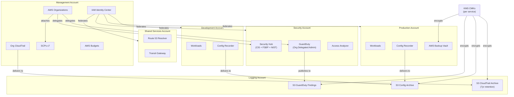
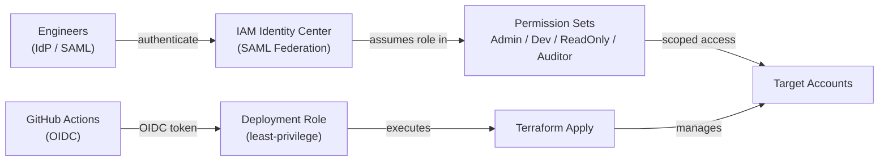
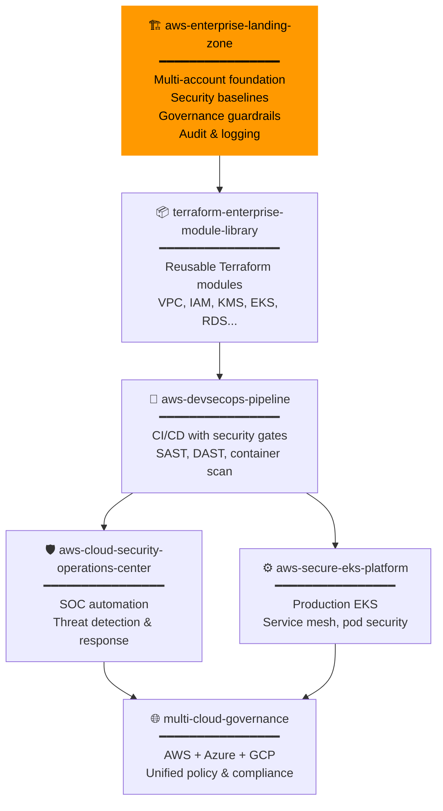
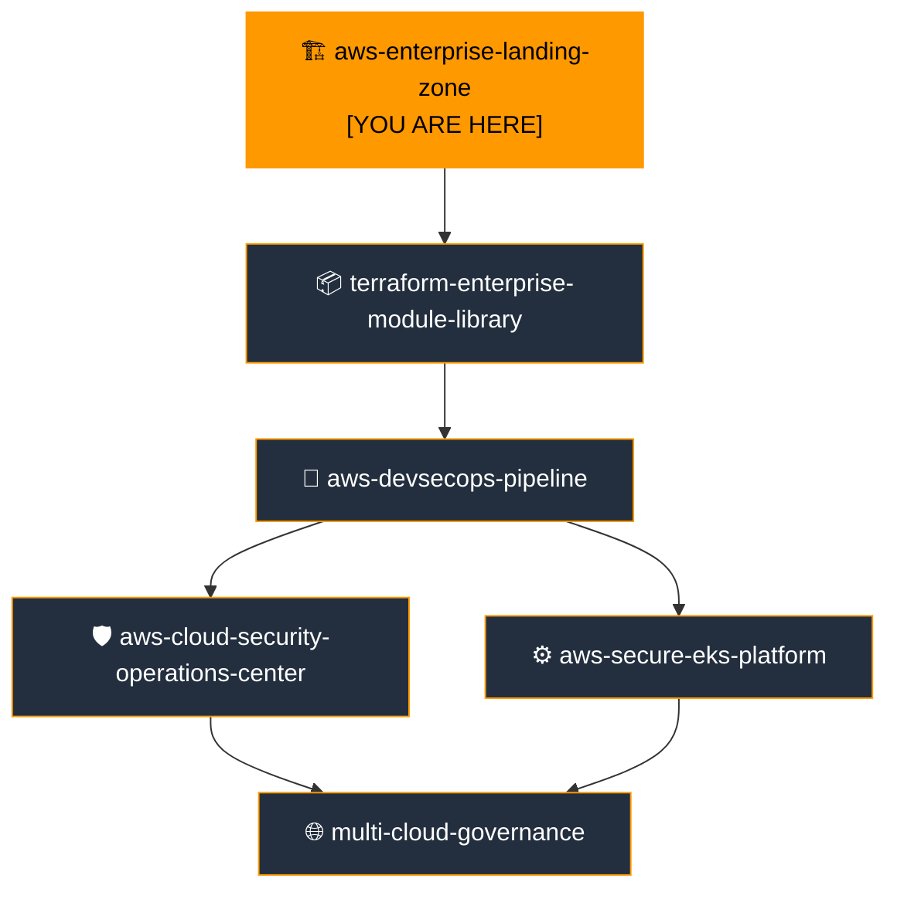

# AWS Enterprise Landing Zone

[](https://github.com/your-org/aws-enterprise-landing-zone-terraform/actions)
[](https://github.com/your-org/aws-enterprise-landing-zone-terraform/actions)
[](LICENSE)
[](https://www.terraform.io)
[](https://registry.terraform.io/providers/hashicorp/aws)

> **Portfolio Position 1 of 6** — Enterprise Cloud Platform  
> Foundation layer providing secure multi-account governance for all downstream platform repositories.

---

## Table of Contents

1. [Executive Summary](#1-executive-summary)
2. [Business Problem](#2-business-problem)
3. [Solution Overview](#3-solution-overview)
4. [Architecture Overview](#4-architecture-overview)
5. [Enterprise Cloud Portfolio Position](#5-enterprise-cloud-portfolio-position)
6. [AWS Services Used](#6-aws-services-used)
7. [Service Selection Rationale](#7-service-selection-rationale)
8. [Terraform Structure](#8-terraform-structure)
9. [Deployment Guide](#9-deployment-guide)
10. [Validation Guide](#10-validation-guide)
11. [Security Controls](#11-security-controls)
12. [Monitoring & Observability](#12-monitoring--observability)
13. [Disaster Recovery Strategy](#13-disaster-recovery-strategy)
14. [Cost Optimization Strategy](#14-cost-optimization-strategy)
15. [Operational Runbooks](#15-operational-runbooks)
16. [AWS Well-Architected Review](#16-aws-well-architected-review)
17. [Skills Demonstrated](#17-skills-demonstrated)
18. [Interview Talking Points](#18-interview-talking-points)
19. [Future Enhancements](#19-future-enhancements)
20. [Related Repositories](#20-related-repositories)

---

## 1. Executive Summary

This repository delivers a **production-grade, security-first AWS Landing Zone** built entirely with Terraform. It establishes the foundational governance layer for a multi-account AWS environment aligned to the **AWS Well-Architected Framework** across all six pillars.

The Landing Zone provisions a complete organisational hierarchy with dedicated Security, Logging, Shared Services, Development, and Production accounts. Every security control is automated: organisations-level CloudTrail, GuardDuty with malware protection, Security Hub with CIS v1.4 and FSBP standards, AWS Config with 20+ managed rules, seven Service Control Policies, KMS encryption for all services, and a 9-alarm CloudWatch security dashboard.

This is **position 1 of 6** in an Enterprise Cloud Platform Portfolio, producing the account structure, IAM Identity Center configuration, and security baselines consumed by every downstream repository.

**Key outcomes:**
- Zero-trust multi-account architecture with complete audit trail
- Automated security-by-default: no manual console configuration required
- CIS AWS Foundations v1.4, FSBP, and NIST 800-53 compliance baselines
- Repeatable, environment-separated Infrastructure-as-Code deployable in under 45 minutes

---

## 2. Business Problem

### The Challenge

Organisations migrating to or growing on AWS frequently encounter:

| Problem | Business Impact |
|---|---|
| Single AWS account for all workloads | Blast radius of a breach covers everything |
| No audit trail or centralised logging | Inability to detect or investigate incidents |
| Ad-hoc IAM policies and root account usage | Privilege escalation risk, compliance failures |
| No guardrails preventing misconfiguration | Public S3 buckets, unencrypted data, disabled security services |
| Manual security configuration | Configuration drift, inconsistency between environments |
| No cost visibility or governance | Runaway spend, untagged resources |

### Regulatory & Compliance Pressure

- **POPIA** (South Africa) — data residency and access controls
- **PCI-DSS** — separation of cardholder data environments
- **SOC 2 Type II** — audit evidence and continuous monitoring
- **ISO 27001** — information security management
- **AWS CIS Benchmarks** — configuration hardening baseline

---

## 3. Solution Overview

### What This Repository Builds

```
┌─────────────────────────────────────────────────────┐
│              AWS ORGANISATION                       │
│                                                     │
│  ┌──────────┐  ┌──────────┐  ┌──────────────────┐   │
│  │ Security │  │ Logging  │  │  Shared Services │   │
│  │ Account  │  │ Account  │  │  Account         │   │
│  └──────────┘  └──────────┘  └──────────────────┘   │
│                                                     │
│  ┌──────────────────┐  ┌──────────────────────────┐ │
│  │ Development      │  │ Production               │ │
│  │ Account          │  │ Account                  │ │
│  └──────────────────┘  └──────────────────────────┘ │
└─────────────────────────────────────────────────────┘
```

**Security controls deployed:**
- 7 Service Control Policies (deny root, deny public S3, restrict regions, protect audit services, require IMDSv2, require TLS, prevent security service deletion)
- Organisation-level CloudTrail with CloudTrail Insights
- GuardDuty with S3 + K8s + malware protection across all accounts
- Security Hub with CIS 1.4, FSBP, and NIST 800-53 standards
- AWS Config with 20 managed rules
- KMS CMKs for CloudTrail, Config, GuardDuty, and Backup
- IAM Identity Center with 4 permission sets
- AWS Backup with vault lock and cold storage lifecycle
- 9 CloudWatch metric filter alarms + security dashboard
- AWS Budgets with 80% and 100% threshold alerts

---

## 4. Architecture Overview

### Multi-Account Architecture



### Network & Trust Architecture



---

## 5. Enterprise Cloud Portfolio Position



### Portfolio Position Detail

| Attribute | Value |
|---|---|
| **Position** | 1 of 6 — Foundation Layer |
| **Type** | Infrastructure & Governance |
| **Deployment order** | Must be deployed first |

**This repository depends on:** Nothing — it is the root of the portfolio.

**This repository produces:**
- AWS Organisation ID and OU structure
- 5 member account IDs (Security, Logging, Shared Services, Dev, Prod)
- KMS CMK ARNs (CloudTrail, Config, GuardDuty, Backup)
- IAM Identity Center instance ARN and permission set ARNs
- Centralised S3 log bucket names
- GuardDuty detector ID
- Security Hub configuration

**Consumed by:**
- `terraform-enterprise-module-library` — uses account IDs and KMS keys
- `aws-devsecops-pipeline` — uses IAM Identity Center and account structure
- `aws-cloud-security-operations-center` — extends GuardDuty and Security Hub
- `aws-secure-eks-platform` — deploys into workload accounts provisioned here
- `multi-cloud-governance` — ingests Security Hub findings

---

## 6. AWS Services Used

| Service | Purpose | Account |
|---|---|---|
| AWS Organizations | Multi-account management, OU hierarchy, SCP enforcement | Management |
| IAM Identity Center | Federated SSO, permission sets, account assignments | Management |
| AWS CloudTrail | Organisation-wide API audit log with Insights | Management → Logging |
| AWS Config | Configuration recording and compliance evaluation | All accounts |
| Amazon GuardDuty | Threat detection with S3, K8s, malware protection | Security |
| AWS Security Hub | Compliance aggregation (CIS, FSBP, NIST) | Security |
| AWS KMS | Customer-managed encryption keys per service | Management |
| Amazon S3 | Centralised log archive, Config snapshots, findings | Logging |
| Amazon CloudWatch | Security metric filters, alarms, dashboards | Management |
| Amazon SNS | Alert notifications for security events | Management / Security |
| Amazon EventBridge | Route GuardDuty and Security Hub findings to SNS | Security |
| AWS Backup | Cross-account backup with vault lock | Prod |
| AWS Budgets | Cost alerting at 80% and 100% | Management |
| AWS IAM | Cross-account deployment roles, Config recorder role | All accounts |

---

## 7. Service Selection Rationale

### AWS Organizations

**Why selected:** Native AWS service for multi-account management — the only solution that provides hierarchical account grouping (OUs), organisation-level service delegation, and SCP enforcement with zero network overhead.

**Problem it solves:** Without Organizations, each account requires separate security configuration, creating configuration drift, inconsistent guardrails, and no blast-radius isolation between workloads.

**Alternatives considered:** Terraform Cloud workspaces for account isolation, manual account management. Both lack SCP enforcement and centralised audit.

**Well-Architected alignment:**
- Security: SCP guardrails prevent any principal from bypassing controls
- Operational Excellence: Account factory enables repeatable provisioning
- Cost Optimization: Consolidated billing with reserved instance sharing

---

### IAM Identity Center (SSO)

**Why selected:** Provides SAML 2.0 federation with external IdPs (Azure AD, Okta, Google Workspace), centralised permission set management across all accounts, and short-lived credentials — no IAM users with long-lived access keys.

**Problem it solves:** Without centralised SSO, engineers need individual IAM users in every account, creating an unmanageable credential sprawl and offboarding risk.

**Alternatives considered:** Individual IAM users per account, AWS SSO (legacy), third-party PAM tools. IAM Identity Center is the AWS-native successor with full Organizations integration.

**Well-Architected alignment:**
- Security: Short-lived credentials, MFA enforced, least-privilege permission sets
- Operational Excellence: Single pane of access management across all accounts

---

### AWS CloudTrail (Organisation Trail)

**Why selected:** The single organisation-level trail captures every API call across all current and future member accounts automatically. CloudTrail Insights detects anomalous API call rates and error rates.

**Problem it solves:** Without CloudTrail, there is no audit evidence for security investigations, no compliance evidence for SOC 2 or ISO 27001, and no forensic capability.

**Alternatives considered:** Per-account trails (higher cost, management overhead, gaps on new accounts), third-party SIEM agents (require compute in every account).

**Enterprise use case:** A bank uses the Organisation Trail to satisfy their internal audit requirement for 7-year API call retention, feeding into a SIEM for real-time alerting on privileged actions.

**Well-Architected alignment:**
- Security: Complete audit trail for all API activity
- Operational Excellence: Insights detect operational anomalies automatically

---

### Amazon GuardDuty

**Why selected:** ML-powered threat detection requiring no agents, no infrastructure, and no tuning. Analyses CloudTrail, VPC Flow Logs, DNS logs, S3 data events, EKS audit logs, and performs malware scanning on EC2 EBS volumes.

**Problem it solves:** Human review of raw CloudTrail logs is impractical at scale. GuardDuty's ML models surface the signal from the noise — detecting credential compromise, C2 communication, and data exfiltration patterns.

**Alternatives considered:** Manual CloudTrail log analysis, third-party SIEM ingestion, Splunk Cloud. GuardDuty is zero-infrastructure, priced per data volume analysed, and has no false-positive tuning burden for common detections.

**Well-Architected alignment:**
- Security: Continuous threat detection across all data sources
- Reliability: Auto-enables on all new member accounts
- Cost Optimization: Pay-per-volume, no compute costs

---

### AWS Security Hub

**Why selected:** Aggregates findings from GuardDuty, Config, Inspector, Macie, and third-party tools into a single compliance dashboard. Provides automated scoring against CIS AWS Foundations, FSBP, and NIST 800-53.

**Problem it solves:** Security findings scattered across multiple services create operational blind spots. Security Hub normalises findings into the ASFF standard and provides a compliance posture score.

**Alternatives considered:** Splunk, Sumo Logic, Datadog Security. All require data egress and additional cost. Security Hub is native, regional, and integrates with EventBridge for automated remediation.

**Well-Architected alignment:**
- Security: Consolidated compliance posture with CRITICAL/HIGH alerting
- Operational Excellence: Single compliance score drives security roadmap priorities

---

### AWS KMS (Customer-Managed Keys)

**Why selected:** Separate CMKs per service provide cryptographic isolation — a compromised CloudTrail key cannot decrypt GuardDuty findings. KMS provides automatic annual rotation, full audit trail in CloudTrail, and fine-grained key policies.

**Problem it solves:** AWS default encryption (SSE-S3, aws/s3) provides encryption but no key governance — the account root can always decrypt. CMKs enable deny-decryption conditions and key-level audit logging.

**Alternatives considered:** AWS managed keys (aws/s3, aws/cloudtrail) — simpler but no customer key policy control. CloudHSM — dedicated HSM for FIPS 140-3 Level 3, warranted for very high compliance environments but 10× the cost.

**Well-Architected alignment:**
- Security: Encryption-at-rest with customer-controlled key lifecycle
- Cost Optimization: KMS key rotation is free; CMKs cost $1/month/key

---

### Service Control Policies (7 Policies)

**Why selected:** SCPs are the only AWS mechanism that can constrain even the root account of a member account. They act as an account-level permission boundary, enforcing guardrails regardless of what IAM policies are attached.

**Policies deployed:**
1. `DenyPublicS3` — prevents any S3 public ACL or disabling of block-public-access
2. `DenyRootAccountUsage` — prevents any action by the root principal
3. `DenyNonApprovedRegions` — restricts activity to approved AWS regions
4. `DenyDisableCloudTrail` — prevents stopping, deleting, or modifying trails
5. `DenyDisableSecurityServices` — prevents disabling GuardDuty, Security Hub, Config, Access Analyzer
6. `RequireIMDSv2` — enforces token-based metadata service on EC2
7. `DenyUnencryptedTransit` — denies S3/SQS/SNS requests without TLS

**Well-Architected alignment:**
- Security: Preventive controls at the highest enforcement level
- Governance: Policy-as-code enforcement across all accounts

---

### AWS Config

**Why selected:** Provides continuous configuration recording, historical snapshots, and compliance evaluation against 20 managed rules covering the CIS AWS Foundations Benchmark. Config is the evidence source for compliance audits.

**Alternatives considered:** Custom Lambda-based config evaluation, third-party CSPM (Prisma Cloud, Wiz). Config is native, integrates with Security Hub and Systems Manager, and provides the configuration history needed for forensic investigation.

**Well-Architected alignment:**
- Security: Detective controls identifying configuration deviations
- Operational Excellence: Configuration history enables root-cause analysis

---

## 8. Terraform Structure

```
aws-enterprise-landing-zone-terraform/
├── provider.tf                    # Terraform version + provider config (NO versions.tf)
├── main.tf                        # Root module — orchestrates all child modules
├── variables.tf                   # All input variables with validation
├── outputs.tf                     # Key outputs consumed by downstream repos
│
├── modules/
│   ├── organization/              # AWS Organizations + OU hierarchy
│   ├── account-vending/           # Member account provisioning
│   ├── kms/                       # CMKs: CloudTrail, Config, GuardDuty, Backup
│   ├── logging/                   # S3 buckets: CloudTrail, Config, GuardDuty
│   ├── cloudtrail/                # Organisation trail with CloudWatch Logs
│   ├── config/                    # Recorder, delivery channel, 20 managed rules
│   ├── guardduty/                 # Detector, org config, S3 publishing, SNS alerts
│   ├── security-hub/              # CIS v1.4 + FSBP + NIST 800-53 standards
│   ├── scp/                       # 7 Service Control Policies
│   ├── iam-identity-center/       # Permission sets, groups, account assignments
│   ├── backup/                    # Vault, vault lock, daily + weekly plans
│   └── monitoring/                # CloudWatch alarms, dashboard, AWS Budgets
│
├── environments/
│   ├── dev/
│   │   ├── backend.tf             # S3 state bucket + DynamoDB lock (dev)
│   │   └── terraform.tfvars.example
│   ├── test/
│   │   ├── backend.tf
│   │   └── terraform.tfvars.example
│   └── prod/
│       ├── backend.tf
│       └── terraform.tfvars.example
│
├── .github/workflows/
│   ├── terraform-plan.yml         # PR gate: tfsec + checkov + plan
│   ├── terraform-apply.yml        # Apply: dev auto, test/prod gated
│   └── terraform-security-scan.yml # Daily: tfsec + checkov + trivy + gitleaks
│
├── policies/
│   └── iam/
│       └── terraform-deployment-role.json
│
├── architecture/
│   └── service-selection-rationale.md
│
├── runbooks/
│   ├── incident-response.md
│   └── disaster-recovery.md
│
├── validation/
│   └── validate-landing-zone.sh
│
├── scripts/
│   ├── bootstrap-state.sh
│   └── setup-oidc.sh
│
├── .gitignore
├── CONTRIBUTING.md
├── SECURITY.md
└── README.md
```

### Module Design Principles

- **One module per concern** — clear separation, independent testability
- **No hardcoded values** — every region, ID, email, and name is a variable
- **Explicit provider passing** — security and logging modules use named providers for cross-account role assumption
- **`prevent_destroy` on accounts** — AWS account deletion is irreversible; Terraform lifecycle guards it
- **`for_each` over `count`** — named resources enable targeted plans and apply operations
- **Sensitive output marking** — KMS key ARNs marked `sensitive = true`

---

## 9. Deployment Guide

### Prerequisites

| Tool | Version | Purpose |
|---|---|---|
| Terraform | ≥ 1.6.0 | IaC engine |
| AWS CLI | ≥ 2.15 | Account bootstrap and validation |
| jq | Any | Output parsing in scripts |
| Python 3 | ≥ 3.9 | Validation script |

**AWS permissions required for initial deployment:** Management account with `AdministratorAccess` (or the scoped policy in `policies/iam/terraform-deployment-role.json`).

---

### Step 1 — Bootstrap Remote State

Run once per environment before `terraform init`:

```bash
# Replace with your organisation short name
export ORG="acme-enterprise"
export ENV="dev"
export AWS_REGION="af-south-1"

bash scripts/bootstrap-state.sh
```

Update `environments/${ENV}/backend.tf` with the output bucket and table names.

---

### Step 2 — Configure OIDC for GitHub Actions

```bash
export GITHUB_ORG="your-github-org"
export GITHUB_REPO="aws-enterprise-landing-zone-terraform"
export ENV="dev"
export AWS_ACCOUNT_ID="123456789012"

bash scripts/setup-oidc.sh
```

Add the output role ARNs as GitHub repository secrets:
- `AWS_PLAN_ROLE_ARN_DEV`
- `AWS_APPLY_ROLE_ARN_DEV`
- `AWS_PLAN_ROLE_ARN_TEST`
- `AWS_APPLY_ROLE_ARN_TEST`
- `AWS_PLAN_ROLE_ARN_PROD`
- `AWS_APPLY_ROLE_ARN_PROD`

---

### Step 3 — Configure Variables

```bash
cp environments/dev/terraform.tfvars.example environments/dev/terraform.tfvars
# Edit environments/dev/terraform.tfvars with real values
# NEVER commit terraform.tfvars
```

---

### Step 4 — Two-Phase Apply

AWS Organizations accounts must be created before cross-account providers can assume roles. Split the apply:

**Phase 1 — Organisation and accounts (management account only)**
```bash
terraform init -backend-config="environments/dev/backend.tf" -reconfigure

terraform apply \
  -var-file="environments/dev/terraform.tfvars" \
  -target=module.organization \
  -target=module.accounts
```

After Phase 1, retrieve the created account IDs:
```bash
terraform output -json | jq '{
  security_account_id: .security_account_id.value,
  logging_account_id: .logging_account_id.value
}'
```

Update `terraform.tfvars` with the account IDs, then run Phase 2:

**Phase 2 — All remaining modules**
```bash
terraform apply -var-file="environments/dev/terraform.tfvars"
```

---

### Step 5 — Validate

```bash
export ENV="dev"
bash validation/validate-landing-zone.sh
```

Expected output: `All validation checks PASSED` or `PASSED with N warning(s)`.

---

### Promotion: DEV → TEST → PROD

```
Dev (auto-apply on merge) → Test (1 approver) → Prod (2 approvers + wait timer)
```

Production deployments require a GitHub Environment protection rule with:
- Minimum 2 reviewers (one must be from Security team)
- 15-minute wait timer after approval
- `workflow_dispatch` only (no auto-apply)

---

## 10. Validation Guide

### Automated Validation

```bash
# Full post-deploy check (10 controls verified)
ENV=prod AWS_REGION=af-south-1 bash validation/validate-landing-zone.sh
```

### Manual Spot Checks

**CloudTrail is logging**
```bash
aws cloudtrail get-trail-status \
  --name $(aws cloudtrail describe-trails --query 'trailList[?IsOrganizationTrail].Name' --output text) \
  --query '{IsLogging:IsLogging, LatestDeliveryTime:LatestDeliveryTime}'
```

**GuardDuty is enabled in all accounts**
```bash
aws guardduty list-detectors --query 'DetectorIds'
aws guardduty get-detector --detector-id <ID> --query 'Status'
```

**Security Hub compliance score**
```bash
aws securityhub describe-standards --query 'Standards[*].{Name:Name,EnabledByDefault:EnabledByDefault}'
```

**SCPs are attached to root**
```bash
aws organizations list-policies-for-target \
  --target-id $(aws organizations list-roots --query 'Roots[0].Id' --output text) \
  --filter SERVICE_CONTROL_POLICY \
  --query 'Policies[*].Name'
```

**KMS key rotation enabled**
```bash
for KEY_ID in $(aws kms list-keys --query 'Keys[*].KeyId' --output text); do
  ROTATION=$(aws kms get-key-rotation-status --key-id $KEY_ID --query 'KeyRotationEnabled' --output text 2>/dev/null || echo "N/A")
  echo "$KEY_ID: rotation=$ROTATION"
done
```

---

## 11. Security Controls

### Identity & Access Management

| Control | Implementation | Standard |
|---|---|---|
| No root access keys | SCP `DenyRootAccountUsage` | CIS 1.1 |
| MFA on all users | IAM Identity Center enforcement | CIS 1.5 |
| No long-lived credentials | OIDC for CI/CD, SSO for humans | CIS 1.13 |
| Least-privilege IAM | Scoped permission sets per role | CIS 1.16 |
| Cross-account access | `OrganizationAccountAccessRole` only | WAF Security |

### Data Protection

| Control | Implementation | Standard |
|---|---|---|
| Encryption at rest | KMS CMKs for all log stores | CIS 2.2, 2.7 |
| Encryption in transit | SCP denies non-TLS S3/SQS/SNS | CIS 2.1 |
| S3 block public access | SCP + S3 bucket policy | CIS 2.1 |
| Log immutability | S3 versioning + deny-delete policy | CIS 3.x |
| Backup encryption | KMS CMK on backup vault | WAF Security |

### Audit & Monitoring

| Control | Implementation | Standard |
|---|---|---|
| API audit trail | Organisation CloudTrail trail | CIS 3.1 |
| Log file validation | `LogFileValidationEnabled = true` | CIS 3.2 |
| CloudTrail Insights | API call rate and error anomaly detection | WAF Security |
| Threat detection | GuardDuty with S3/K8s/malware | WAF Security |
| Compliance posture | Security Hub CIS + FSBP + NIST | CIS, NIST |
| Config compliance | 20 AWS Config managed rules | CIS 2.x, 3.x |
| Security alarms | 9 CloudWatch metric filter alarms | CIS 4.x |

### Governance Guardrails (SCPs)

| SCP | What it prevents |
|---|---|
| `DenyPublicS3` | S3 public ACLs and disabling block-public-access |
| `DenyRootAccountUsage` | Any action by root account principal |
| `DenyNonApprovedRegions` | AWS activity outside approved regions |
| `DenyDisableCloudTrail` | Stopping, deleting, or modifying trails |
| `DenyDisableSecurityServices` | Disabling GuardDuty, Security Hub, Config, Access Analyzer |
| `RequireIMDSv2` | EC2 instances using IMDSv1 token-optional mode |
| `DenyUnencryptedTransit` | S3/SQS/SNS requests without `aws:SecureTransport` |

---

## 12. Monitoring & Observability

### CloudWatch Security Dashboard

The `landing-zone-security` dashboard displays:
- Unauthorised API call rate (5-min rolling)
- Root account login events
- IAM policy change events
- Console sign-in without MFA events
- S3 bucket policy changes
- Security group change events
- KMS key deletion events

### CIS-Aligned Metric Alarms (Section 4)

| Alarm | CIS Control | Threshold |
|---|---|---|
| Unauthorized API calls | 4.1 | ≥ 1 event / 5 min |
| Root account login | 4.3 | Any event |
| Console sign-in without MFA | 4.2 | Any event |
| IAM policy changes | 4.4 | Any event |
| CloudTrail config changes | 4.5 | Any event |
| S3 bucket policy changes | 4.8 | Any event |
| Network ACL changes | 4.11 | Any event |
| Security group changes | 4.10 | Any event |
| KMS key deletion | 4.7 | Any event |

### Alert Routing

```
CloudTrail Logs → CloudWatch Metric Filter → Alarm → SNS Topic → Email / PagerDuty / Slack
GuardDuty Finding (severity ≥ 7) → EventBridge → SNS → PagerDuty (P1)
Security Hub CRITICAL/HIGH → EventBridge → SNS → Slack #cloud-security
```

### AWS Budgets

- **80% forecast alert** — notifies before overspend
- **100% actual alert** — immediate notification on threshold breach
- Both alerts sent to `budget_alert_email` variable

---

## 13. Disaster Recovery Strategy

### Recovery Objectives

| Tier | Service | RTO | RPO |
|---|---|---|---|
| Tier 0 — Critical | CloudTrail, GuardDuty, SCPs | 1 hour | 15 min |
| Tier 1 — High | Config, IAM Identity Center | 4 hours | 1 hour |
| Tier 2 — Standard | Monitoring dashboards | 24 hours | 4 hours |

### DR Architecture

- **Primary Region:** af-south-1 (Cape Town)
- **DR Region:** eu-west-1 (Ireland)
- **S3 Cross-Region Replication:** CloudTrail and Config logs replicated automatically
- **KMS Multi-Region Keys:** Enable decryption in DR region without re-encryption
- **Terraform State:** Backed up via S3 versioning (30 retained versions)
- **AWS Organisations:** Global service — no regional DR required

### Recovery Procedures

See [`runbooks/disaster-recovery.md`](runbooks/disaster-recovery.md) for step-by-step procedures covering:
- Region-level failure
- Terraform state corruption
- KMS key accidental deletion
- GuardDuty/Security Hub disablement

---

## 14. Cost Optimization Strategy

### Service Cost Profile

| Service | Pricing model | Optimisation |
|---|---|---|
| AWS Organizations | Free | N/A |
| IAM Identity Center | Free | N/A |
| CloudTrail | $2/100K management events | 1 trail covers all accounts |
| GuardDuty | Volume-based per GB analysed | Disable unused data sources in dev |
| Security Hub | $0.0010 per finding check | Suppress known false positives |
| KMS | $1/key/month + $0.03/10K requests | Bucket key enabled (reduces API calls) |
| AWS Config | $0.003 per configuration item | Exclude noisy resources in dev |
| CloudWatch | Log ingestion + storage | 90-day log retention in dev |
| S3 (logs) | Storage + requests | Lifecycle to STANDARD_IA (90d) → GLACIER (365d) |
| AWS Backup | Storage + restore | Cold storage after 30 days |

### Environment-Specific Cost Controls

**Dev:**
- 90-day log retention (vs 365 for prod)
- Reduced Config recording frequency
- Monthly budget: $100 with email alert

**Test:**
- 180-day log retention
- Monthly budget: $250

**Prod:**
- Full 365-day hot retention + 7-year Glacier
- Monthly budget: $5,000 with PagerDuty escalation

### Estimated Monthly Cost (organisation baseline)

| Component | Estimated Cost (USD/month) |
|---|---|
| CloudTrail (org trail) | $5–15 |
| GuardDuty (5 accounts) | $30–80 |
| Security Hub | $10–25 |
| Config (20 rules, 5 accounts) | $25–60 |
| KMS (4 keys) | $4 |
| S3 log storage (first year) | $10–30 |
| CloudWatch | $5–15 |
| **Total** | **~$89–229/month** |

---

## 15. Operational Runbooks

| Runbook | Location | Covers |
|---|---|---|
| Incident Response | [`runbooks/incident-response.md`](runbooks/incident-response.md) | Root login, GuardDuty findings, SCP removal, public S3 |
| Disaster Recovery | [`runbooks/disaster-recovery.md`](runbooks/disaster-recovery.md) | Region failure, state corruption, key deletion, service disablement |

### Common Day-2 Operations

**Add a new AWS account to the organisation:**
```bash
# 1. Add email to variables
# 2. Add aws_organizations_account resource to account-vending module
# 3. terraform plan → terraform apply -target=module.accounts
# 4. IAM Identity Center assignments auto-apply from account_map output
```

**Rotate Terraform deployment credentials:**
```bash
# No rotation needed — OIDC tokens are ephemeral (1-hour TTL)
# If role needs updating, modify policies/iam/terraform-deployment-role.json and re-apply
```

**Review Security Hub findings:**
```bash
aws securityhub get-findings \
  --filters '{"SeverityLabel":[{"Value":"CRITICAL","Comparison":"EQUALS"},{"Value":"HIGH","Comparison":"EQUALS"}],"WorkflowStatus":[{"Value":"NEW","Comparison":"EQUALS"}]}' \
  --query 'Findings[*].{Title:Title,Severity:Severity.Label,AccountId:AwsAccountId}' \
  --output table
```

---

## 16. AWS Well-Architected Review

### Operational Excellence

| Practice | Implementation |
|---|---|
| Operations as code | All infrastructure is Terraform — no manual console changes |
| Annotate and document | Comprehensive variable descriptions, runbooks, architecture docs |
| Refine operations procedures | Post-incident review template, quarterly runbook review |
| Anticipate failure | DR strategy with RTO/RPO targets |
| Learn from all events | CloudTrail Insights surfaces API anomalies automatically |

### Security

| Practice | Implementation |
|---|---|
| Strong identity foundation | IAM Identity Center, no IAM users, OIDC for CI/CD |
| Enable traceability | Organisation CloudTrail, CloudTrail Insights, all API logged |
| Apply security at all layers | SCPs (org), Config rules (account), KMS (data), GuardDuty (runtime) |
| Automate security best practices | SCPs prevent misconfiguration before it occurs |
| Protect data in transit and at rest | TLS-only SCP, KMS CMKs, S3 block-public-access |
| Keep people away from data | Cross-account roles for access, no direct data access |
| Prepare for security events | Incident response runbooks, GuardDuty → PagerDuty automation |

### Reliability

| Practice | Implementation |
|---|---|
| Recover from failure automatically | GuardDuty auto-enables on new accounts |
| Test recovery procedures | DR runbook with quarterly testing schedule |
| Scale horizontally | Organisation trail auto-covers new accounts |
| Stop guessing capacity | Serverless security services (GuardDuty, Config, Security Hub) |
| Manage change in automation | All changes through Terraform + GitHub Actions |

### Performance Efficiency

| Practice | Implementation |
|---|---|
| Democratise advanced technologies | Security Hub aggregates findings from 4+ services automatically |
| Go global in minutes | Multi-region trail, S3 CRR for log replication |
| Use serverless architectures | All security services are managed/serverless |
| Experiment more often | Dev environment for testing new SCPs before prod |

### Cost Optimization

| Practice | Implementation |
|---|---|
| Implement Cloud Financial Management | AWS Budgets with 80%/100% alerts |
| Adopt consumption model | Pay-per-use GuardDuty, Config, Security Hub |
| Measure overall efficiency | Cost allocation tags on all resources |
| Eliminate undifferentiated lifting | Managed services (no EC2 for security) |
| Analyse and attribute expenditure | Cost center tagging via default_tags |

### Sustainability

| Practice | Implementation |
|---|---|
| Understand impact | Resource tagging enables carbon tracking |
| Maximise utilisation | Serverless services — no idle compute |
| Anticipate and adopt efficient offerings | Migrate to new GuardDuty features as released |
| Use managed services | Zero infrastructure footprint for all security controls |
| Reduce downstream impact | Centralised logging eliminates per-account log duplication |

---

## 17. Skills Demonstrated

### Cloud Architecture
- Multi-account AWS architecture with purpose-built account segregation
- Security-by-default design with preventive and detective controls
- Cross-account role assumption and provider federation patterns
- Well-Architected Framework applied across all six pillars

### Cloud Security
- Service Control Policies at organisation root
- CIS AWS Foundations Benchmark v1.4 implementation
- KMS customer-managed key design with least-privilege key policies
- GuardDuty organisation delegation and multi-data-source configuration
- Security Hub multi-standard aggregation

### Terraform Engineering
- Modular architecture with explicit inter-module dependencies
- Provider aliasing for cross-account resource management
- Variable validation with regex and `contains()` constraints
- `for_each` with `local` maps for scalable resource creation
- Sensitive output handling and `prevent_destroy` lifecycle guards
- Remote state with S3 + DynamoDB and KMS encryption
- Two-phase apply pattern for bootstrapping

### DevSecOps / CI/CD
- GitHub Actions OIDC authentication (no long-lived AWS keys)
- tfsec + checkov + trivy + TFLint + gitleaks in PR pipeline
- SARIF upload to GitHub Security tab
- Environment protection rules: dev auto, test 1 reviewer, prod 2 reviewers
- Scheduled drift detection with `terraform plan -detailed-exitcode`

### Governance & Compliance
- AWS Config managed rule implementation (20 rules)
- CloudWatch metric filter alarms for CIS Section 4
- AWS Budgets cost governance
- Tagging strategy with mandatory `default_tags`
- IAM Identity Center permission set design

---

## 18. Interview Talking Points

### "Walk me through how you secure a multi-account AWS environment."

> "I start with AWS Organizations and enable SCPs at the root level — these are the highest-priority guardrails that not even a member account's root user can bypass. In this Landing Zone, I deployed seven SCPs: preventing root usage, blocking public S3, restricting regions, protecting the audit services from being disabled, and enforcing IMDSv2 and TLS. The detective layer sits in a dedicated Security account: GuardDuty for threat detection with ML-based anomaly detection across CloudTrail, VPC Flow Logs, S3, and EKS; Security Hub aggregating compliance posture across CIS, FSBP, and NIST 800-53; and AWS Config recording every configuration change with 20 managed rules. CloudTrail runs as a single organisation-level trail, which is more cost-effective than per-account trails and automatically covers every new account."

### "Why separate accounts rather than one account with VPCs?"

> "VPC isolation is network isolation — it doesn't prevent a compromised IAM identity from accessing a different VPC in the same account. Account isolation is permission boundary isolation: even with full admin in one account, you cannot access another account's resources without explicit cross-account trust. The blast radius of a breach is contained. It also enables separate billing, separate service limits, separate SCP scopes, and different compliance postures per environment — you can't accidentally run a prod workload with dev permissions."

### "How do you handle Terraform state security?"

> "State files are stored in S3 with KMS encryption and versioning enabled, access is restricted by bucket policy to the deployment role, TLS is enforced by a deny-non-TLS bucket policy, and DynamoDB provides distributed locking. The S3 state bucket itself is bootstrapped by a separate script that runs before the first Terraform init — it can't be in Terraform because you'd need state to track the state bucket. OIDC authentication means no AWS access keys are stored in GitHub at all — the GitHub Actions OIDC token exchanges for a short-lived IAM role credential scoped only to the deployment permissions in `policies/iam/terraform-deployment-role.json`."

### "What's the difference between GuardDuty and Security Hub?"

> "GuardDuty is a threat detector — it uses ML to identify active threats like credential compromise, C2 communication, or data exfiltration from your CloudTrail and network logs. Security Hub is a compliance aggregator — it collects findings from GuardDuty, Config, Inspector, Macie, and third-party tools, normalises them to ASFF, and scores your environment against compliance frameworks like CIS and NIST. They're complementary: GuardDuty detects what's happening now; Security Hub tells you what configuration risks make you vulnerable."

### "How do you approach the principle of least privilege?"

> "In this Landing Zone I applied it at four levels: SCPs at the organisation level act as a ceiling, restricting what any account's IAM policies can grant. IAM Identity Center permission sets are scoped by role — CloudAdmins get AdministratorAccess with a 2-hour session, Developers get a scoped inline policy covering only their services, SecurityAuditors get ReadOnly and SecurityAudit. The Terraform deployment role uses a custom policy in `policies/iam/terraform-deployment-role.json` that grants only the specific actions needed by each module, plus a Deny condition for destructive actions on prod-tagged resources. Finally, KMS key policies explicitly enumerate which principals can use each key."

---

## 19. Future Enhancements

| Enhancement | Priority | Effort | Well-Architected Pillar |
|---|---|---|---|
| AWS Control Tower migration | High | Large | Operational Excellence |
| AWS Security Lake for SIEM integration | High | Medium | Security |
| AWS Detective for investigation | Medium | Small | Security |
| Amazon Macie for S3 data classification | Medium | Small | Security |
| AWS IAM Access Analyzer cross-account | High | Small | Security |
| Inspector v2 for EC2 + container scanning | Medium | Medium | Security |
| AWS Firewall Manager for WAF + Shield | Medium | Medium | Reliability |
| Centralised patch management (SSM) | Medium | Medium | Operational Excellence |
| S3 Intelligent-Tiering for log storage | Low | Small | Cost Optimization |
| Terraform Sentinel policies | Low | Large | Governance |
| AWS Compute Optimizer integration | Low | Small | Cost Optimization |

---

## 20. Related Repositories

### Enterprise Cloud Platform Portfolio



| Repository | Role | Relationship |
|---|---|---|
| **[aws-enterprise-landing-zone](https://github.com/your-org/aws-enterprise-landing-zone-terraform)** | Foundation | **YOU ARE HERE** |
| **[terraform-enterprise-module-library](https://github.com/your-org/terraform-enterprise-module-library)** | Reusable modules | Consumes: account IDs, KMS keys, VPC outputs |
| **[aws-devsecops-pipeline](https://github.com/your-org/aws-devsecops-pipeline)** | CI/CD platform | Consumes: IAM Identity Center, account structure |
| **[aws-cloud-security-operations-center](https://github.com/your-org/aws-cloud-security-operations-center)** | SOC automation | Consumes: GuardDuty, Security Hub, CloudTrail |
| **[aws-secure-eks-platform](https://github.com/your-org/aws-secure-eks-platform)** | Container platform | Consumes: VPC, IAM, KMS from module library |
| **[multi-cloud-governance](https://github.com/your-org/multi-cloud-governance)** | Unified governance | Consumes: Security Hub findings from this Landing Zone |

### Dependency Map

```
Dependencies (what this repo needs):    None — foundation layer

Produces (outputs consumed downstream):
  → organisation_id                     used by: terraform-enterprise-module-library
  → security_account_id                 used by: aws-cloud-security-operations-center
  → logging_account_id                  used by: aws-devsecops-pipeline
  → kms_cloudtrail_key_arn              used by: terraform-enterprise-module-library
  → guardduty_detector_id               used by: aws-cloud-security-operations-center
  → cloudtrail_bucket_name              used by: aws-cloud-security-operations-center
  → iam_identity_center.sso_instance_arn used by: aws-devsecops-pipeline, aws-secure-eks-platform
```

---

## Author

**Emmanuel Mulenga** — Multi-Cloud Engineer
- 🌐 [](https://www.linkedin.com/in/emmanuel-mulenga)
- 💻 [](https://github.com/e-mulenga)

---

*AWS Enterprise Landing Zone — Enterprise Cloud Platform Portfolio | Position 1 of 6*
